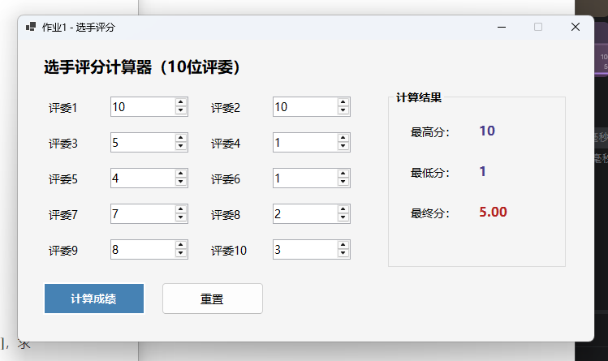
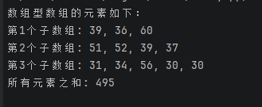

# 作业1程序说明

## 关键代码

### 1. 题目一：评分计算核心代码

对应位置：`Form1.cs` 第 `5-29` 行

```csharp
private readonly NumericUpDown[] _scoreInputs;

public Form1()
{
    InitializeComponent();

    _scoreInputs =
    [
        numJudge1, numJudge2, numJudge3, numJudge4, numJudge5,
        numJudge6, numJudge7, numJudge8, numJudge9, numJudge10
    ];
}

private void btnCalculate_Click(object sender, EventArgs e)
{
    decimal[] scores = _scoreInputs.Select(input => input.Value).ToArray();

    decimal maxScore = scores.Max();
    decimal minScore = scores.Min();
    decimal finalScore = (scores.Sum() - maxScore - minScore) / (scores.Length - 2);

    lblHighestValue.Text = maxScore.ToString("0.##");
    lblLowestValue.Text = minScore.ToString("0.##");
    lblFinalValue.Text = finalScore.ToString("0.00");
}
```

### 2. 题目一：重置功能代码

对应位置：`Form1.cs` 第 `31-42` 行

```csharp
private void btnReset_Click(object sender, EventArgs e)
{
    foreach (NumericUpDown input in _scoreInputs)
    {
        input.Value = 1;
    }

    lblHighestValue.Text = "-";
    lblLowestValue.Text = "-";
    lblFinalValue.Text = "-";
    numJudge1.Focus();
}
```

### 3. 题目一：界面初始化关键代码

对应位置：`Form1.Designer.cs` 第 `51-149` 行、`265-277` 行

```csharp
private void InitializeComponent()
{
    lblTitle = new Label();
    tableScores = new TableLayoutPanel();
    numJudge1 = CreateScoreInput();
    numJudge2 = CreateScoreInput();
    numJudge3 = CreateScoreInput();
    numJudge4 = CreateScoreInput();
    numJudge5 = CreateScoreInput();
    numJudge6 = CreateScoreInput();
    numJudge7 = CreateScoreInput();
    numJudge8 = CreateScoreInput();
    numJudge9 = CreateScoreInput();
    numJudge10 = CreateScoreInput();
    btnCalculate = new Button();
    btnReset = new Button();
    groupResult = new GroupBox();

    tableScores.Controls.Add(CreateJudgeLabel("评委1"), 0, 0);
    tableScores.Controls.Add(numJudge1, 1, 0);
    tableScores.Controls.Add(CreateJudgeLabel("评委2"), 2, 0);
    tableScores.Controls.Add(numJudge2, 3, 0);
    tableScores.Controls.Add(CreateJudgeLabel("评委3"), 0, 1);
    tableScores.Controls.Add(numJudge3, 1, 1);
    tableScores.Controls.Add(CreateJudgeLabel("评委4"), 2, 1);
    tableScores.Controls.Add(numJudge4, 3, 1);
    tableScores.Controls.Add(CreateJudgeLabel("评委5"), 0, 2);
    tableScores.Controls.Add(numJudge5, 1, 2);
    tableScores.Controls.Add(CreateJudgeLabel("评委6"), 2, 2);
    tableScores.Controls.Add(numJudge6, 3, 2);
    tableScores.Controls.Add(CreateJudgeLabel("评委7"), 0, 3);
    tableScores.Controls.Add(numJudge7, 1, 3);
    tableScores.Controls.Add(CreateJudgeLabel("评委8"), 2, 3);
    tableScores.Controls.Add(numJudge8, 3, 3);
    tableScores.Controls.Add(CreateJudgeLabel("评委9"), 0, 4);
    tableScores.Controls.Add(numJudge9, 1, 4);
    tableScores.Controls.Add(CreateJudgeLabel("评委10"), 2, 4);
    tableScores.Controls.Add(numJudge10, 3, 4);

    btnCalculate.Text = "计算成绩";
    btnCalculate.Click += btnCalculate_Click;
    btnReset.Text = "重置";
    btnReset.Click += btnReset_Click;

    groupResult.Text = "计算结果";
    Text = "作业1 - 选手评分";
}

private static NumericUpDown CreateScoreInput()
{
    return new NumericUpDown
    {
        DecimalPlaces = 0,
        Maximum = 10,
        Minimum = 1,
        Size = new Size(96, 25),
        Value = 1
    };
}
```

### 4. 题目二：数组型数组核心代码

对应位置：`Program.cs` 第 `1-24` 行

```csharp
int[][] scores =
[
    new int[3],
    new int[4],
    new int[5]
];

Random random = new();
int total = 0;

Console.WriteLine("数组型数组的元素如下：");

for (int i = 0; i < scores.Length; i++)
{
    for (int j = 0; j < scores[i].Length; j++)
    {
        scores[i][j] = random.Next(30, 61);
        total += scores[i][j];
    }

    Console.WriteLine($"第{i + 1}个子数组: {string.Join(", ", scores[i])}");
}

Console.WriteLine($"所有元素之和: {total}");
```

## 程序结果

### 1. WinForms 评分程序结果

程序界面采用 10 个数值输入框录入评委打分，每个输入框都限制在 1 到 10 分之间。以下截图给出了一次示例计算过程：当 10 位评委分别打出 `9、8、10、7、9、8、6、10、7、8` 时，程序计算得到最高分为 `10`，最低分为 `6`，去掉一个最高分和一个最低分后，其余 8 个分数的平均值为 `8.25`。

{ width=15cm }

### 2. 控制台数组程序结果

控制台程序定义了一个包含 3 个子数组的数组型数组，三个子数组的长度分别为 `3`、`4`、`5`。程序运行时会在区间 `[30, 60]` 内随机生成每个元素的值，并输出全部元素以及所有元素之和。下图展示的是一次实际运行结果，总和为 `540`。

{ width=15cm }

## 结果分析

### 1. WinForms 评分程序分析

该程序的核心思路是先收集 10 位评委的分数，再分别求出最高分和最低分，最后使用“总分减去一个最高分和一个最低分，再除以 8”的方式得到选手最终得分。这样能够避免极端高分或极端低分对最终结果产生过大影响，符合题目要求。

在输入方式上，程序使用 `NumericUpDown` 控件代替普通文本框，从界面层面直接限制了分值只能在 `1` 到 `10` 之间输入，因此不容易出现非法字符、空字符串或越界数据，输入可靠性更高。程序还提供了“重置”按钮，便于重复测试不同评分数据。

### 2. 控制台数组程序分析

该程序使用锯齿数组来表示“数组型数组”，三个子数组长度分别设置为 `3`、`4`、`5`，与题目完全一致。通过两层循环为每个元素赋随机值，并在赋值的同时累加总和，因此逻辑清晰，效率也较高。

需要注意的是，随机数生成使用的是 `random.Next(30, 61)`。由于 `Next` 方法的上界不包含在结果中，所以这种写法能够正确生成 `30` 到 `60` 之间的整数，确保题目要求的闭区间范围被完整覆盖。程序每次运行得到的具体数组元素可能不同，但数组结构、取值范围和求和逻辑始终保持正确。

### 3. 综合说明

两道题分别体现了图形界面程序和控制台程序的基本实现方法。第一题重点在于界面交互、输入约束和业务计算；第二题重点在于数组结构设计、随机数据生成和循环处理。整体程序结构清晰，命名规范，能够满足作业中对“关键代码、程序结果、结果分析”的提交要求。
