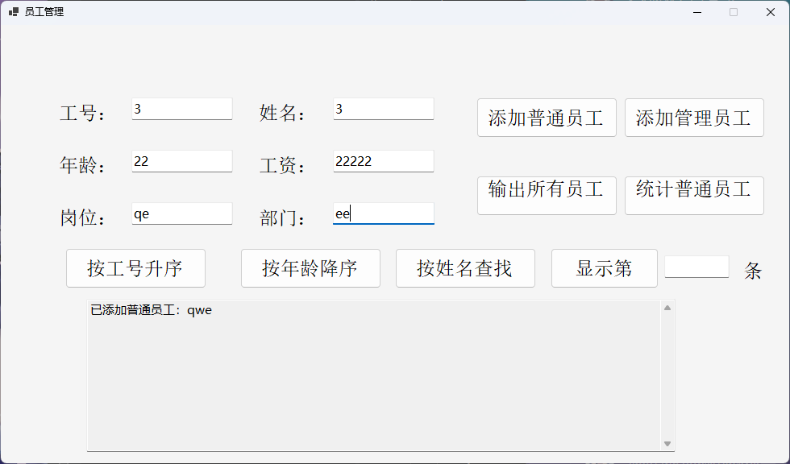
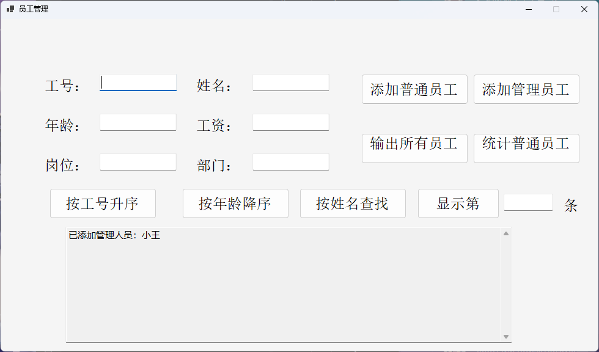
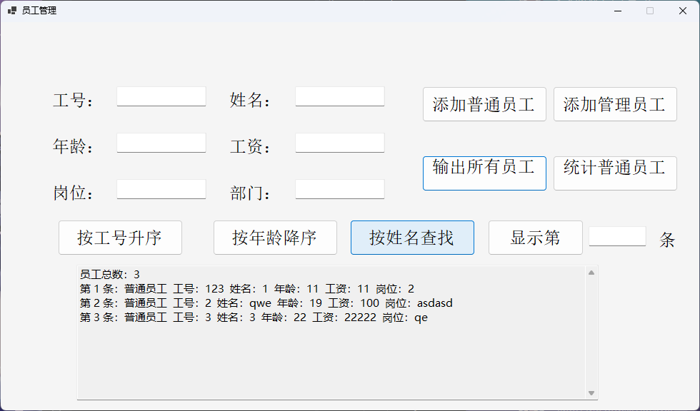
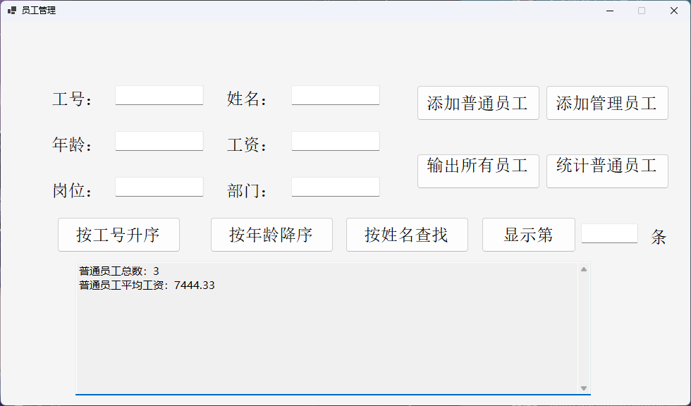
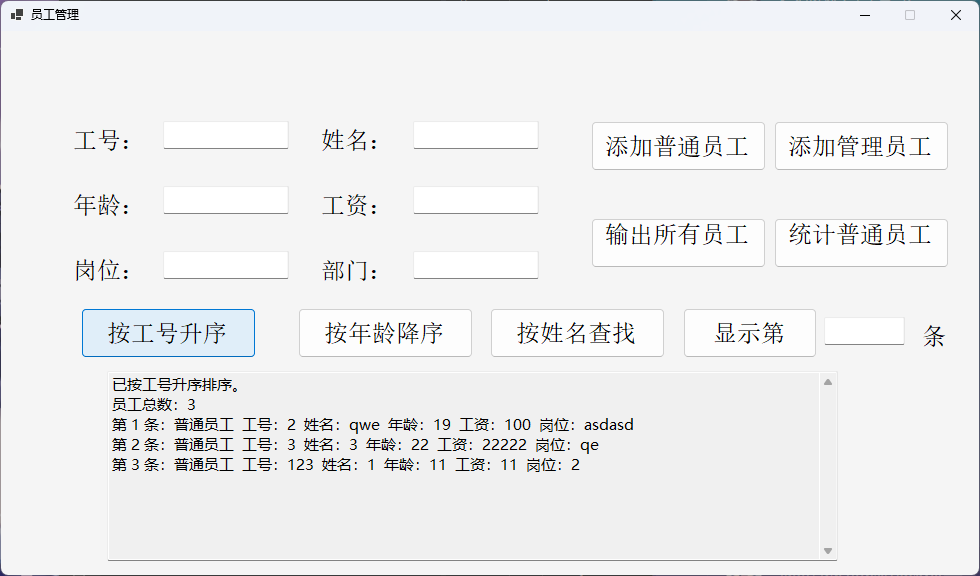
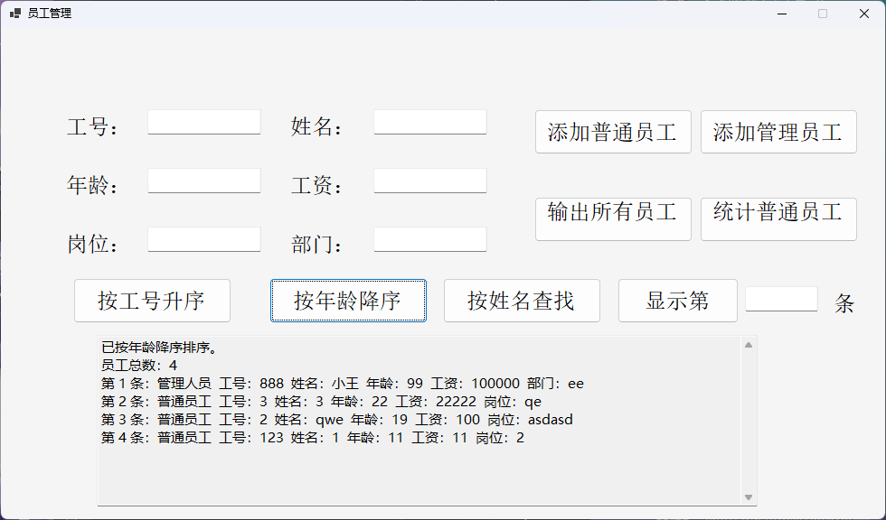
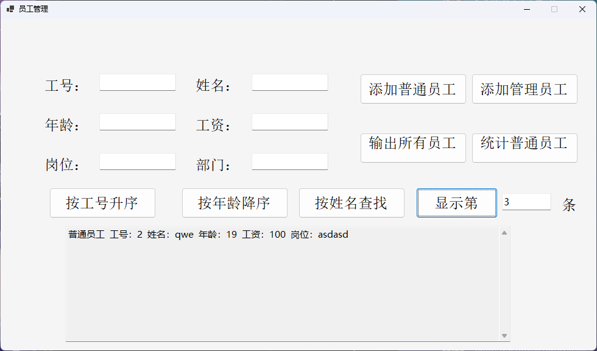

# 作业2程序说明

## 一、关键代码

### 1. 员工抽象基类

对应位置：`Employee.cs`

```csharp
namespace EmployeeApp;

public abstract class Employee : IComparable<Employee>
{
    private int id;
    private string name;
    private int age;
    private decimal salary;

    // 统计已经创建的员工对象数量，输出员工列表时显示总数。
    private static int totalCount;

    protected Employee(int id, string name, int age, decimal salary)
    {
        this.id = id;
        this.name = name;
        this.age = age;
        this.salary = salary;
        totalCount++;
    }

    public int Id
    {
        get => id;
        set => id = value;
    }

    public string Name
    {
        get => name;
        set => name = value;
    }

    public int Age
    {
        get => age;
        set => age = value;
    }

    public decimal Salary
    {
        get => salary;
        set => salary = value;
    }

    public static int TotalCount => totalCount;

    public int CompareTo(Employee? other)
    {
        // 排序时如果比较对象为空，当前对象排在空对象之后，避免空引用异常。
        if (other is null)
        {
            return 1;
        }

        return Id.CompareTo(other.Id);
    }

    // 不同员工类型的输出格式不同，因此定义为抽象方法，由子类重写。
    public abstract string GetMessage();
}
```

该部分代码体现了封装、抽象类和接口的使用。员工的工号、姓名、年龄、工资使用私有字段保存，通过属性对外访问；`CompareTo` 方法用于后续按工号排序；`GetMessage()` 定义为抽象方法，使普通员工和管理人员可以输出各自不同的信息格式。

### 2. 普通员工类和管理人员类

对应位置：`Staff.cs`、`Manager.cs`

```csharp
namespace EmployeeApp;

public class Staff : Employee
{
    private string post;

    public Staff(int id, string name, int age, decimal salary, string post)
        : base(id, name, age, salary)
    {
        this.post = post;
    }

    public string Post
    {
        get => post;
        set => post = value;
    }

    public override string GetMessage()
    {
        return $"普通员工  工号：{Id}  姓名：{Name}  年龄：{Age}  工资：{Salary:0.##}  岗位：{Post}";
    }
}
```

```csharp
namespace EmployeeApp;

public class Manager : Employee
{
    private string department;

    public Manager(int id, string name, int age, decimal salary, string department)
        : base(id, name, age, salary)
    {
        this.department = department;
    }

    public string Department
    {
        get => department;
        set => department = value;
    }

    public override string GetMessage()
    {
        return $"管理人员  工号：{Id}  姓名：{Name}  年龄：{Age}  工资：{Salary:0.##}  部门：{Department}";
    }
}
```

普通员工类增加岗位字段，管理人员类增加部门字段。两个类都继承 `Employee`，并重写 `GetMessage()` 方法。这样在员工列表中保存基类对象时，程序仍然可以根据实际对象类型输出“岗位”或“部门”，实现了多态。

### 3. 员工列表泛型类

对应位置：`EmployeeList.cs`

```csharp
using System.Text;

namespace EmployeeApp;

public class EmployeeList<T> where T : Employee
{
    private readonly List<T> employees = [];

    public int Count => employees.Count;

    // 整数索引用于按“第几条”显示员工。
    public T this[int index] => employees[index];

    // 字符串索引用于按姓名查找员工，忽略大小写。
    public T? this[string name]
    {
        get
        {
            return employees.FirstOrDefault(employee =>
                string.Equals(employee.Name, name, StringComparison.CurrentCultureIgnoreCase));
        }
    }

    public void Add(T employee)
    {
        employees.Add(employee);
    }

    public string Display()
    {
        StringBuilder builder = new();
        builder.AppendLine($"员工总数：{Employee.TotalCount}");

        // 空列表时给出明确提示，避免界面输出空白。
        if (employees.Count == 0)
        {
            builder.AppendLine("暂无员工信息。");
            return builder.ToString();
        }

        for (int i = 0; i < employees.Count; i++)
        {
            builder.AppendLine($"第 {i + 1} 条：{employees[i].GetMessage()}");
        }

        return builder.ToString();
    }

    public (int staffCount, decimal averageSalary) Average()
    {
        Staff[] staffs = employees.OfType<Staff>().ToArray();

        // 没有普通员工时返回 0，避免对空集合调用 Average() 抛出异常。
        if (staffs.Length == 0)
        {
            return (0, 0);
        }

        return (staffs.Length, staffs.Average(staff => staff.Salary));
    }

    public void SortByIdAscending()
    {
        employees.Sort((left, right) => left.CompareTo(right));
    }

    public void SortByAgeDescending()
    {
        employees.Sort((left, right) => right.Age.CompareTo(left.Age));
    }
}
```

该泛型类负责管理员工数据。`Add()` 完成员工添加，`Display()` 输出全部员工，两个索引器分别支持按序号访问和按姓名查找，`Average()` 统计普通员工平均工资，排序方法分别实现按工号升序和按年龄降序。代码中对空列表、无普通员工等边界情况进行了处理，避免运行异常。

### 4. 窗体事件和错误处理

对应位置：`Form1.cs`

```csharp
private void btnAddStaff_Click(object sender, EventArgs e)
{
    if (!TryReadCommonFields(out int id, out string name, out int age, out decimal salary))
    {
        return;
    }

    string post = txtPost.Text.Trim();
    if (string.IsNullOrWhiteSpace(post))
    {
        ShowInputError("请输入岗位。");
        txtPost.Focus();
        return;
    }

    employees.Add(new Staff(id, name, age, salary, post));
    txtResult.Text = $"已添加普通员工：{name}";
    ClearInputs();
}

private void btnAddManager_Click(object sender, EventArgs e)
{
    if (!TryReadCommonFields(out int id, out string name, out int age, out decimal salary))
    {
        return;
    }

    string department = txtDepartment.Text.Trim();
    if (string.IsNullOrWhiteSpace(department))
    {
        ShowInputError("请输入部门。");
        txtDepartment.Focus();
        return;
    }

    employees.Add(new Manager(id, name, age, salary, department));
    txtResult.Text = $"已添加管理人员：{name}";
    ClearInputs();
}
```

```csharp
private bool TryReadCommonFields(out int id, out string name, out int age, out decimal salary)
{
    id = 0;
    name = txtName.Text.Trim();
    age = 0;
    salary = 0;

    if (!int.TryParse(txtId.Text.Trim(), out id) || id <= 0)
    {
        ShowInputError("工号必须是正整数。");
        txtId.Focus();
        return false;
    }

    if (string.IsNullOrWhiteSpace(name))
    {
        ShowInputError("请输入姓名。");
        txtName.Focus();
        return false;
    }

    if (!int.TryParse(txtAge.Text.Trim(), out age) || age <= 0)
    {
        ShowInputError("年龄必须是正整数。");
        txtAge.Focus();
        return false;
    }

    if (!decimal.TryParse(txtSalary.Text.Trim(), out salary) || salary < 0)
    {
        ShowInputError("工资必须是非负数字。");
        txtSalary.Focus();
        return false;
    }

    return true;
}
```

```csharp
private void btnShowByIndex_Click(object sender, EventArgs e)
{
    if (!int.TryParse(txtIndex.Text.Trim(), out int displayIndex))
    {
        ShowInputError("请输入要显示的序号。");
        txtIndex.Focus();
        return;
    }

    int index = displayIndex - 1;
    if (index < 0 || index >= employees.Count)
    {
        ShowInputError("序号超出员工范围。");
        txtIndex.Focus();
        return;
    }

    txtResult.Text = employees[index].GetMessage();
}

private static void ShowInputError(string message)
{
    MessageBox.Show(message, "输入错误", MessageBoxButtons.OK, MessageBoxIcon.Warning);
}
```

窗体事件中没有直接转换输入，而是统一调用 `TryReadCommonFields()` 读取公共字段。该函数分别检查工号、姓名、年龄和工资是否合法；岗位、部门和显示序号也分别进行了非空和边界检查。错误发生时，程序通过消息框提示具体原因，并把焦点移动到对应输入框，便于用户修改。

## 二、程序结果

### 1. 添加普通员工

输入普通员工的工号、姓名、年龄、工资和岗位后，点击“添加普通员工”，程序提示“已添加普通员工：qwe”，说明普通员工对象创建成功并加入员工列表。

{ width=15cm }

::: {custom-style="Image Caption"}
图 1 添加普通员工运行结果
:::

### 2. 添加管理人员

输入管理人员的工号、姓名、年龄、工资和部门后，点击“添加管理员工”，程序提示“已添加管理人员：小王”，说明管理人员对象创建成功，并且能够与普通员工保存在同一个员工列表中。

{ width=15cm }

::: {custom-style="Image Caption"}
图 2 添加管理人员运行结果
:::

### 3. 输出所有员工

点击“输出所有员工信息”后，程序输出员工总数和每一条员工记录，普通员工显示岗位，管理人员显示部门，输出格式清楚。

{ width=15cm }

::: {custom-style="Image Caption"}
图 3 输出所有员工运行结果
:::

### 4. 统计普通员工平均工资

点击“统计普通员工平均工资”后，程序输出普通员工总数和普通员工平均工资。

{ width=15cm }

::: {custom-style="Image Caption"}
图 4 普通员工平均工资统计结果
:::

### 5. 按工号升序排序

点击“按工号升序”后，程序先提示已经完成排序，然后重新输出员工列表。

{ width=15cm }

::: {custom-style="Image Caption"}
图 5 按工号升序排序运行结果
:::

### 6. 按年龄降序排序

点击“按年龄降序”后，程序按照年龄从大到小重新排列员工信息。

{ width=15cm }

::: {custom-style="Image Caption"}
图 6 按年龄降序排序运行结果
:::

### 7. 显示指定序号员工

在“显示第”输入框中输入 `3`，点击按钮后，程序输出第 3 条员工的信息。

{ width=15cm }

::: {custom-style="Image Caption"}
图 7 显示指定序号员工运行结果
:::

## 三、结果分析

### 1. 功能实现分析

从运行结果可以看出，程序能够完成员工信息管理的主要功能。添加普通员工和添加管理人员两个功能分别创建 `Staff` 和 `Manager` 对象，并将它们加入同一个 `EmployeeList<Employee>` 集合中。输出所有员工时，普通员工显示“岗位”，管理人员显示“部门”，说明继承和多态机制工作正常。

按姓名查找和按序号显示分别使用字符串索引器和整数索引器完成。按工号升序排序使用 `Employee.CompareTo()` 比较工号，按年龄降序排序使用自定义比较函数比较年龄。截图中排序后的工号和年龄顺序符合按钮功能说明，说明排序逻辑正确。

### 2. 平均工资分析

截图中普通员工工资分别为 `100`、`22222` 和 `11`，普通员工总数为 `3`。程序输出的平均工资为 `7444.33`，手工计算如下：

```text
(100 + 22222 + 11) / 3 = 7444.333...
```

程序以两位小数显示结果，所以最终显示为 `7444.33`。该结果说明程序只统计了普通员工，没有把管理人员工资计入普通员工平均工资，统计范围正确。

### 3. 代码质量分析

程序按职责拆分为员工基类、普通员工类、管理人员类、员工列表类和窗体类，结构清晰。类名、属性名和方法名能够直接反映用途，例如 `SortByIdAscending()` 表示按工号升序排序，`SortByAgeDescending()` 表示按年龄降序排序，`TryReadCommonFields()` 表示读取并检查公共输入字段。

代码中通过注释标明了员工总数统计、索引器用途、空集合处理、平均工资边界情况和输入错误处理等关键位置。整体缩进规范，按钮事件中的业务逻辑较清楚，没有把所有功能都堆在一个方法中。

### 4. 错误处理分析

程序对常见错误输入进行了处理。工号和年龄必须为正整数，工资必须为非负数字，姓名、岗位和部门不能为空；按序号显示员工时，程序先检查输入是否为整数，再检查序号是否超出员工数量范围。错误发生时，程序会弹出“输入错误”提示框，并把焦点放回对应输入框。

平均工资统计也考虑了没有普通员工的情况：如果普通员工数量为 `0`，程序直接返回平均工资 `0`，避免对空集合调用 `Average()` 引发异常。员工列表为空时，`Display()` 会输出“暂无员工信息”，避免结果区域没有任何提示。

### 5. 综合结论

本程序能够正确实现员工添加、员工显示、姓名查找、序号显示、工号排序、年龄排序和普通员工平均工资统计等功能。程序结果与手工分析一致，输出格式较规范；代码结构清晰，命名较规范，并对空输入、非法数字、越界序号和空集合统计等情况进行了错误处理，满足作业对代码质量、功能实现和错误处理的要求。
