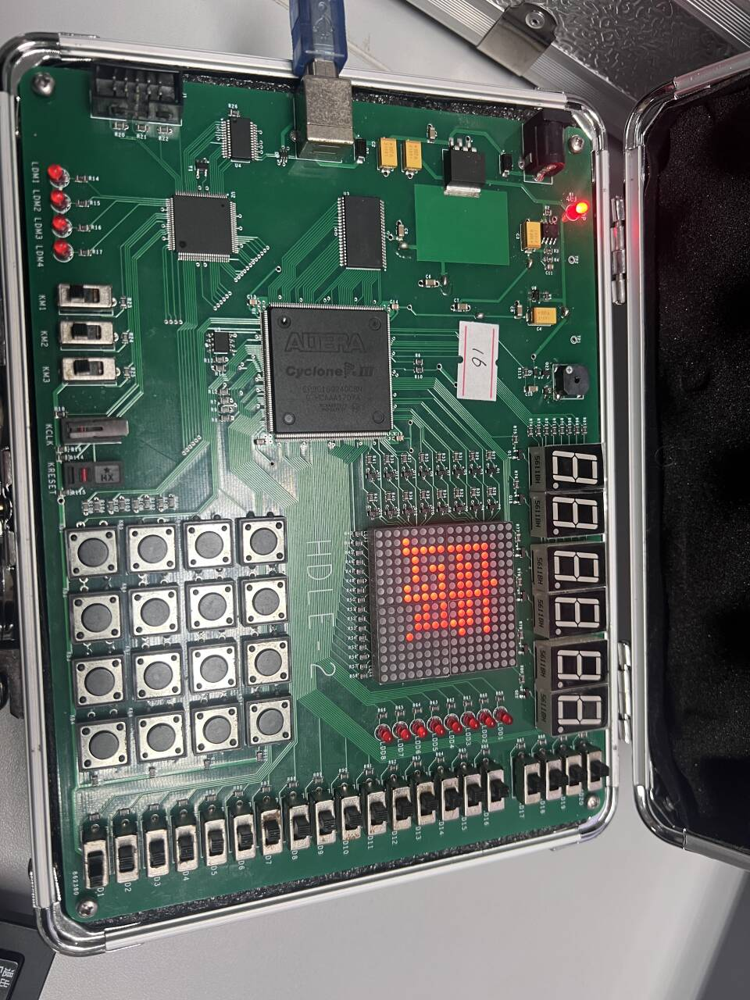
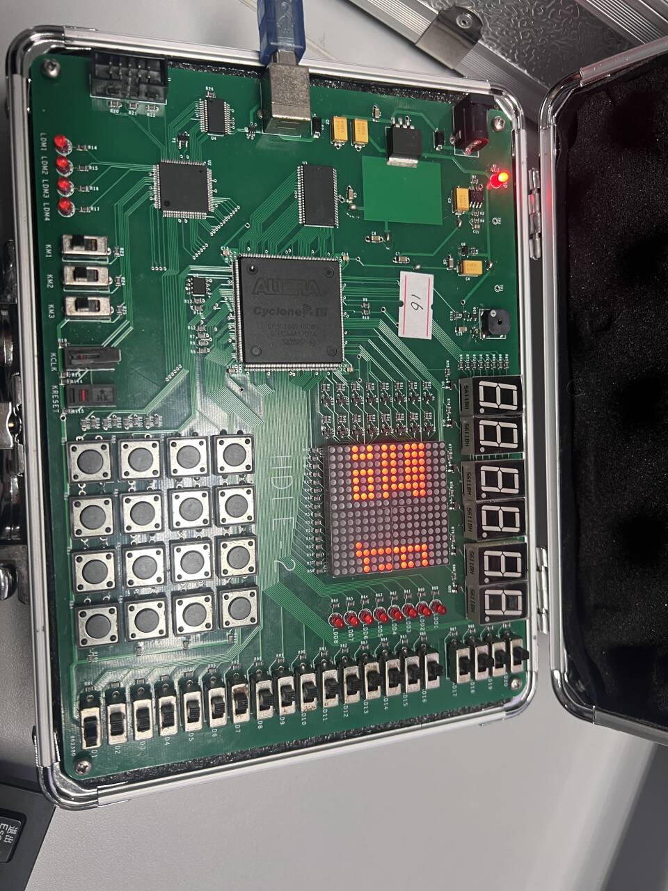
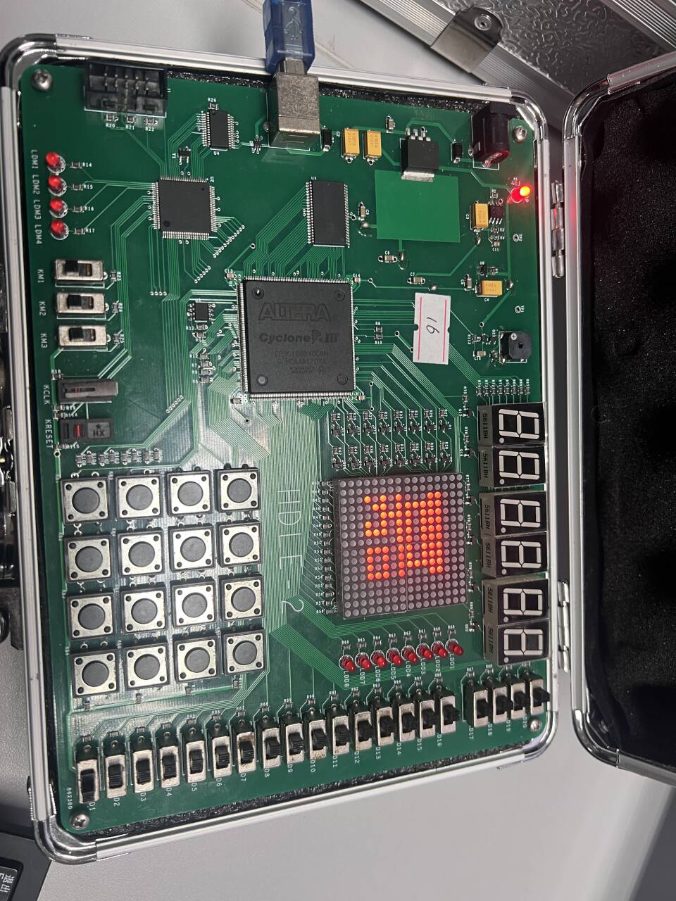
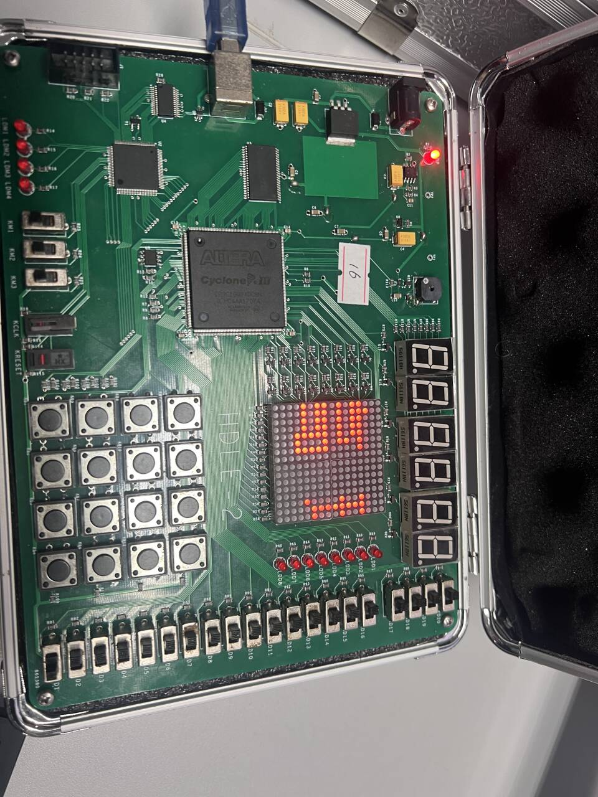
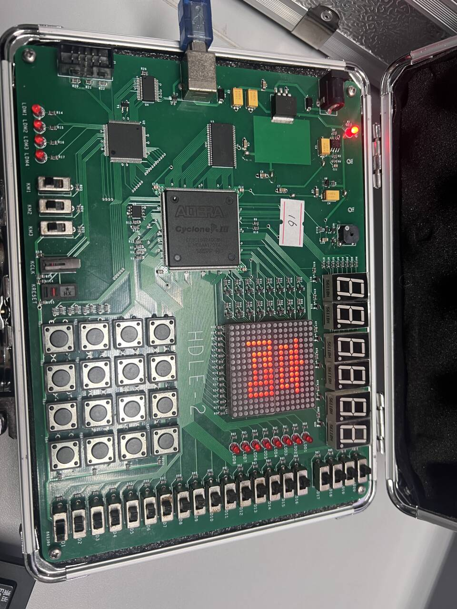

# 实验十二 LED点阵显示实验

[预习报告]{custom-style="副标题"}

## 一、实验目的
1. 掌握 LED 点阵显示屏的工作原理及驱动方式。
2. 学习使用 VHDL 语言设计 LED 点阵扫描控制器。
3. 掌握利用 ROM 存储汉字字模数据的方法。
4. 实现汉字及字符在 16×16 LED 点阵上的静态及动态（滚动）显示。

## 二、实验原理
### 1. LED 点阵显示原理
LED 点阵显示屏由发光二极管排列成矩阵组成。本实验使用的是 16×16 的 LED 点阵。为了节省 I/O 口，通常采用行列扫描的方式进行驱动。
- **行扫描**：依次点亮每一行（或列），同时在另一方向送出该行（或列）对应的数据。
- **视觉暂留**：只要扫描频率足够高（通常大于 50Hz），人眼就感觉不到闪烁，看到的是一幅完整的画面。

### 2. 字模提取与存储
要在点阵上显示字符，首先需要提取字符的点阵数据（字模）。对于 16×16 点阵，每个字符需要 16 行 × 16 列 = 256 位数据，通常用 16 个 16 位二进制数（或 16 进制数）表示。
本实验中，字模数据存储在 VHDL 代码的常量数组（ROM）中。

### 3. 滚动显示原理
通过改变显示数据在 ROM 中的读取起始地址或在显示缓冲区中的偏移量，可以实现字符的上下或左右滚动显示。

## 三、实验内容
1. 使用 Python 脚本或取模软件生成“20231202051计科1班高康嘉”等字符的 16×16 点阵字模数据。
2. 编写 VHDL 程序，实现 LED 点阵的扫描控制。
3. 实现字符的左右或上下滚动显示功能。
4. 在 Quartus II 中完成编译、引脚分配，并下载到 FPGA 开发板进行验证。

## 四、实验所用设备
1. 实验室 PC（安装 Quartus II 13.1 及 ModelSim 软件）
2. FPGA 实验箱（核心芯片：Cyclone III EP3C16Q240C8）
3. USB-Blaster 下载线

## 五、实验步骤
1. **字模生成**：运行 `gen_font_v2.py` 脚本，生成所需字符的点阵数据。
2. **工程建立**：在 Quartus II 中新建工程 `led_matrix`。
3. **代码编写**：编写 `led_matrix.vhd`，定义字模 ROM，设计分频器、扫描计数器和滚动逻辑。
4. **引脚分配**：根据实验箱电路图，分配时钟、复位、波动开关及 LED 点阵的行、列驱动引脚。
5. **编译与下载**：编译工程，生成 `.sof` 文件，下载至 FPGA。
6. **观察验证**：操作波动开关，观察 LED 点阵的显示效果。

---

[实验报告]{custom-style="副标题"}

## 一、实验步骤

### 1. 字模数据准备
利用 Python 脚本提取了“20231202051计科1班高康嘉”共 18 个字符的字模数据。由于硬件电路连接原因，字模数据进行了左右镜像处理。

### 2. VHDL 代码设计
程序主要包含以下模块：
- **分频模块**：
  - 扫描时钟：将 24MHz 系统时钟分频产生约 10kHz 的扫描信号，用于行扫描。
  - 滚动时钟：产生约 24Hz 的低频信号，用于控制文字滚动的速度。
- **ROM 存储模块**：定义 `type char_rom` 存储所有字符的点阵数据。
- **扫描与显示逻辑**：
  - `row_cnt` 控制当前扫描的行（0-15）。
  - 根据 `offset_x` 和 `offset_y` 计算当前应该显示的数据位。
  - 输出 `row`（行选）和 `col`（列选）信号。

### 3. 引脚分配
根据 `led_matrix.qsf` 文件，关键引脚分配如下：

| 信号名称 | 引脚号 | 说明 |
| :--- | :--- | :--- |
| clk | PIN_210 | 24MHz 系统时钟 |
| reset | PIN_151 | 复位按钮 |
| KD[1] | PIN_37 | 向左滚动控制 |
| KD[2] | PIN_38 | 向右滚动控制 |
| KD[3] | PIN_41 | 向上滚动控制 |
| KD[4] | PIN_43 | 向下滚动控制 |
| row[0]~row[15] | PIN_142, PIN_137... | LED 点阵行选 |
| col[0]~col[15] | PIN_110, PIN_109... | LED 点阵列选 |

### 4. 编译与下载
完成代码编写和引脚分配后，点击 "Start Compilation" 进行全编译。编译无误后，通过 USB-Blaster 将程序下载到 FPGA 芯片。

## 二、实验数据及结果分析

### 1. 实验结果展示
下载程序后，LED 点阵屏成功显示了预设的字符，并能通过波动开关控制滚动方向。











### 2. 结果分析
- **扫描频率**：代码中设置扫描分频计数器上限为 2399，即扫描频率 $f_{scan} = 24MHz / 2400 = 10kHz$。对于 16 行扫描，每行刷新频率为 $10kHz / 16 = 625Hz$，远高于人眼视觉暂留阈值（50Hz），因此显示稳定无闪烁。
- **滚动速度**：滚动分频计数器上限为 999999，即滚动频率 $f_{scroll} = 24MHz / 1000000 = 24Hz$。文字每秒移动 24 个像素位置，滚动流畅。
- **显示效果**：字符清晰，亮度均匀。通过波动开关 KD1-KD4 可以灵活控制文字的滚动方向，验证了逻辑设计的正确性。

## 三、实验结论
1. 成功实现了基于 FPGA 的 16×16 LED 点阵显示控制。
2. 验证了行扫描原理的可行性，合适的扫描频率保证了良好的显示效果。
3. 掌握了在 VHDL 中使用多维数组构建 ROM 存储字模数据的方法。
4. 实现了字符的动态滚动显示，加深了对时序控制和地址运算的理解。

## 四、总结及心得体会
- **关键操作要点**：在字模提取时，必须注意点阵的行列顺序以及高低位顺序，特别是硬件电路可能存在的镜像连接，需要通过软件预处理（如本实验中的左右镜像）或在硬件描述语言中进行位序调整。
- **知识关联**：本次实验将数字逻辑中的计数器、分频器、多路选择器以及存储器（ROM）等知识点综合应用，实现了具体的显示功能。
- **问题与解决**：在调试过程中，最初发现显示的汉字是反的，经过分析电路原理图和代码，发现是列选信号的位序问题，通过在 Python 脚本中增加镜像处理步骤解决了该问题。
- **能力提升**：提升了软硬件协同设计的能力（Python 处理数据 + VHDL 硬件控制），以及实际动手调试 FPGA 电路的能力。

## 五、附录（实验源码）

### 1. led_matrix.vhd (核心代码摘要)
```vhdl
-- 部分代码摘要
PROCESS(clk)
BEGIN
    IF rising_edge(clk) THEN
        -- 扫描分频
        IF div_scan = 2399 THEN
            div_scan <= 0;
            IF row_cnt = 15 THEN
                row_cnt <= 0;
            ELSE
                row_cnt <= row_cnt + 1;
            END IF;
        ELSE
            div_scan <= div_scan + 1;
        END IF;
        
        -- 滚动分频与逻辑 (略)
        
    END IF;
END PROCESS;

-- 行列输出
row_out <= (OTHERS => '1');
row_out(row_cnt) <= '0'; -- 选中当前行
row <= row_out;
col <= NOT data_l; -- 列数据输出（低电平点亮）
```
