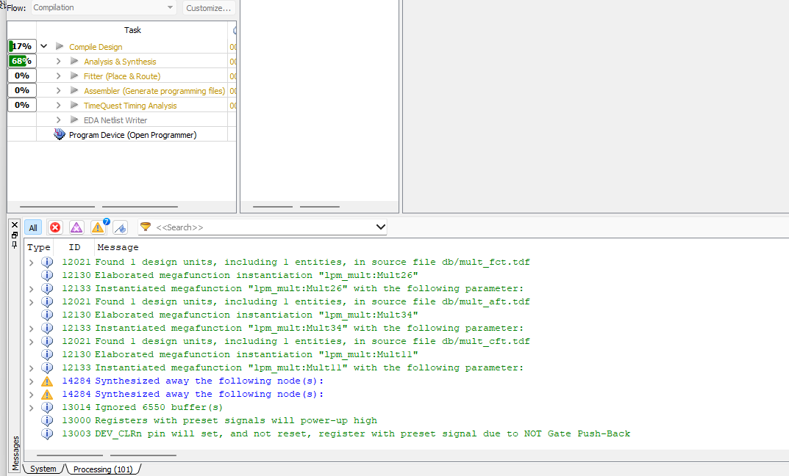
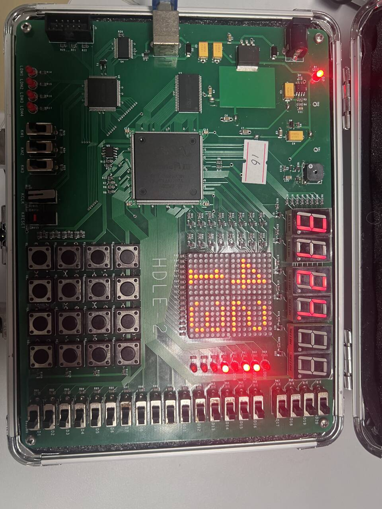
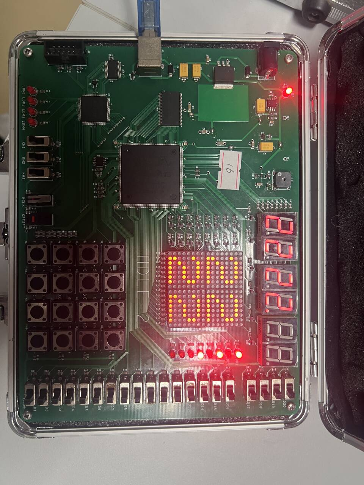
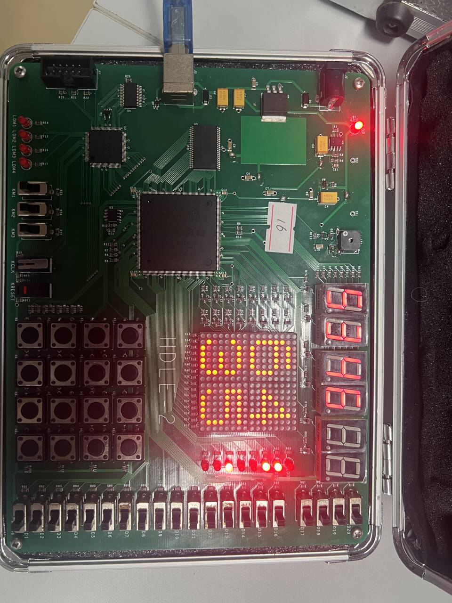
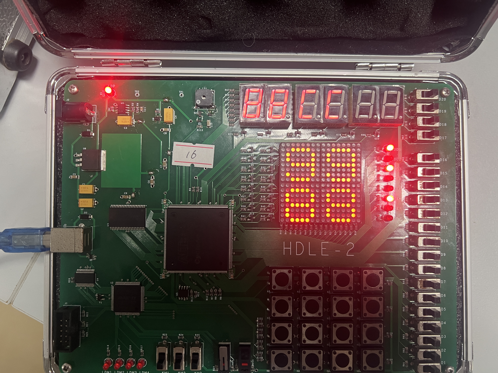
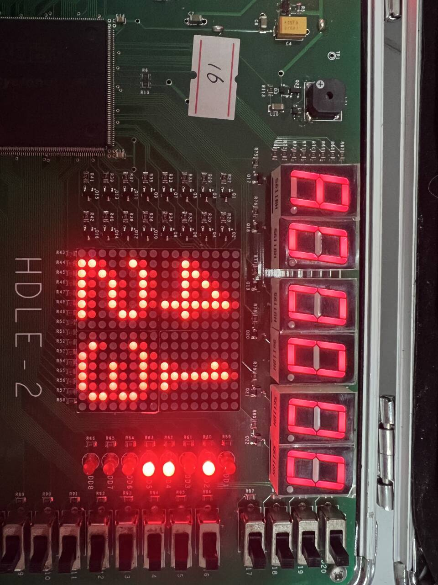
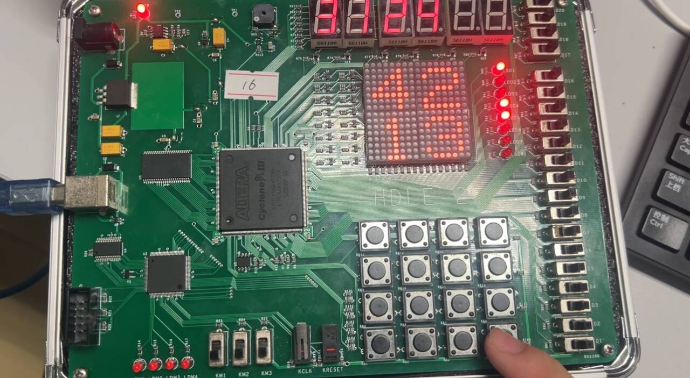
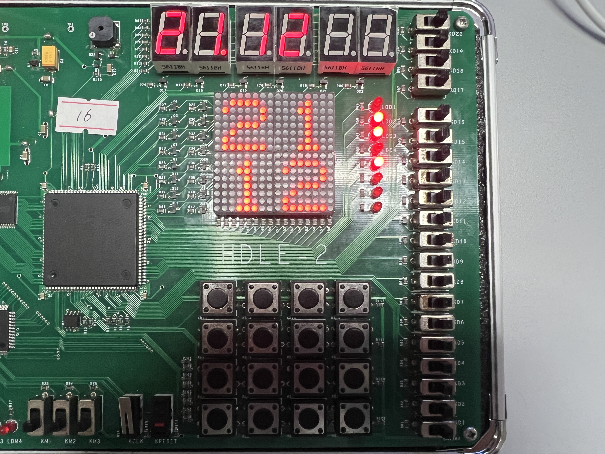
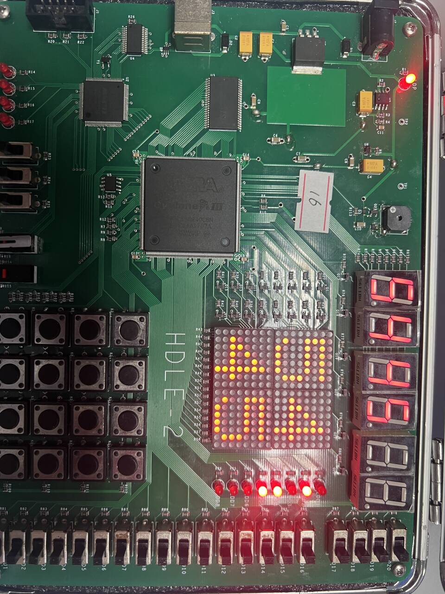

::: {custom-style="Subtitle"}
预习报告部分
:::

## 一、实验目的

（1）进一步加强同学们对VHDL语言的理解和掌握，提升VHDL语言应用能力。

（2）锻炼同学们综合运用所学知识，理论结合实际，解决实际开发中所遇问题的能力。

（3）培养同学们文献查阅能力、自主学习能力、综合设计能力，进一步提高同学们的科学研究素养。

## 二、实验原理

### （1）4×4矩阵键盘工作原理

4×4矩阵键盘由4行（Row）和4列（Column）组成，行线与列线交叉处放置按键。键盘扫描的基本原理是：轮流将某一行设置为低电平（低有效选通），同时读取4列的电平状态。如果某一列在当前行被选中时为低电平，则说明该行该列交叉处的按键被按下。

按键识别是整个系统的关键环节，既要正确判断键盘中有无按键按下，又要正确判断按键所在位置。机械按键在按下和释放瞬间会产生抖动信号（抖动时间通常为5~10ms），若不进行去抖处理，会导致一次按键被识别为多次按下。为了保持信号的稳定性，必须完成去抖动工作。

本实验采用的去抖方法是帧级去抖：按固定节拍扫描4行形成一帧，连续若干帧检测到同一键值后才确认按键有效，输出一次有效脉冲信号。释放时同样需要连续稳定帧确认，保证「按下只触发一次」。

### （2）键盘按键映射

本实验采用常见的4×4矩阵键盘布局，16个按键按以下方式映射：

| 按键位置 | 键值 |
|----------|------|
| 第1行 | 1、2、3、A |
| 第2行 | 4、5、6、B |
| 第3行 | 7、8、9、C |
| 第4行 | *、0、#、D |

其中：数字键0~9用于输入矩阵元素，A键作为模式切换键，B键执行加法运算，C键执行乘法运算，D键用于切换矩阵A/B输入，*键和#键作为功能确认/取消键。

### （3）2×2矩阵运算原理

设2×2矩阵 $A$ 和 $B$ 为：

$$
A=\begin{bmatrix}a_{11}&a_{12}\\a_{21}&a_{22}\end{bmatrix},\quad
B=\begin{bmatrix}b_{11}&b_{12}\\b_{21}&b_{22}\end{bmatrix}
$$

**矩阵加法**：$C=A+B$，逐元素相加

$$
c_{ij}=a_{ij}+b_{ij}
$$

**矩阵乘法**：$C=A\times B$

$$
\begin{aligned}
c_{11}&=a_{11}b_{11}+a_{12}b_{21}\\
c_{12}&=a_{11}b_{12}+a_{12}b_{22}\\
c_{21}&=a_{21}b_{11}+a_{22}b_{21}\\
c_{22}&=a_{21}b_{12}+a_{22}b_{22}
\end{aligned}
$$

**矩阵转置**：$A^T$ 通过交换 $a_{12}$ 与 $a_{21}$ 实现

$$
A^T=\begin{bmatrix}a_{11}&a_{21}\\a_{12}&a_{22}\end{bmatrix}
$$

**行列式**：$\det(A)=a_{11}a_{22}-a_{12}a_{21}$

**矩阵乘方**：$A^n$ 可用快速幂思想转化为多次矩阵乘法，硬件上采用多周期方式实现

**模方**：本实验自定义运算，先求 $M=A^T A$，再计算四元素平方和

$$
\mathrm{nor}(A)=m_{11}^2+m_{12}^2+m_{21}^2+m_{22}^2
$$

### （4）动态扫描显示原理

实验平台数码管与16×16 LED点阵均采用动态扫描显示方式。动态扫描的原理是：轮流选通各位数码管（或LED点阵的各行），在选通期间送出相应的段码（或列数据），利用人眼的视觉暂留作用（视觉暂留时间约为1/24秒），产生多位数码管同时显示的效果。

数码管显示部分采用动态扫描显示，即轮流向数码管送出字形码和位选信号，利用人的视觉暂留作用，产生数码管同时显示的效果。由于实验平台数码管与LED点阵均为低电平点亮，为节省I/O口并保证显示亮度与稳定性，必须保证足够的刷新频率（通常大于50Hz）。

### （5）多周期运算原理

在FPGA上实现整数运算，特别是除法运算，需要采用多周期操作。矩阵运算中的除法（如行列式非零时的逆矩阵计算）可采用移位相减法或查表法实现。乘方运算采用快速幂算法，将指数的二进制位分解，通过多次乘法和平方操作完成多周期运算。

## 三、实验内容

1. 根据键盘工作原理，设计并实现矩阵键盘的扫描。

2. 规划键盘，设定数字和运算符按键。

3. 通过键盘阵列实现矩阵的输入，并在LED点阵上显示。

4. 将矩阵数据进行运算，运算结果在数码管上显示和LED点阵上显示。

5. 本实验所处理的矩阵为2×2矩阵，矩阵运算包括对矩阵求转置、求乘方、求行列式、模方（$A^T A$的所有元素的平方和）等功能。

## 四、实验所用设备

1. 实验室PC（Quartus II 13.1或等效版本）

2. FPGA实验箱HDLE-2（Cyclone III：EP3C16Q240C8）

3. USB-Blaster下载线

4. 实验箱外设：4×4矩阵键盘、16×16 LED点阵、6位数码管、LED灯条、蜂鸣器

## 五、实验步骤

1. 建立工程

2. 编辑代码

3. 编译及修改错误

4. 实验平台装载程序

5. 演示实验结果

::: {custom-style="Subtitle"}
实验报告部分
:::

## 一、实验步骤

### （1）工程建立与模块划分

在exp14/目录建立Quartus工程exp14_top，并将系统拆分为四个核心模块，便于独立调试与复用：

- key_scanner.vhd：矩阵键盘扫描、去抖与键值解码，输出key_strobe/key_val

- matrix_calculator.vhd：矩阵A/B寄存器、模式状态机与运算（加/乘/转置/乘方/行列式/模方）

- seg6_mux.vhd：6位数码管动态扫描（位选/段选均低有效）

- led_matrix_2x2_hex.vhd：16×16 LED点阵动态扫描与2×2数字显示（行列均低有效）

### （2）引脚约束与外设有效电平确认

依据实验箱硬件资料与exp14_top.qsf完成引脚分配。关键约束包括：clk（PIN_210，24MHz连续时钟）、reset（PIN_151，复位按钮）、buzzer（PIN_174），以及键盘、点阵、数码管、LED灯条等外设引脚。由于多数字段为低电平有效，顶层集成时需统一内部有效电平，并在输出端正确取反。

### （3）核心模块实现要点

1. 键盘扫描模块：逐行扫描并在每帧完成后解码键值，采用帧级去抖，按下后只输出一次key_strobe，保证运算模块不会因抖动/长按重复触发。

2. 运算核心模块：使用状态机组织交互流程，编辑模式用于录入矩阵，结果查看模式用于显示加/乘结果，单矩阵模式提供转置/乘方/行列式/模方等操作；乘方采用多周期快速幂实现，计算结束后回写矩阵寄存器。

3. 显示模块：数码管与点阵均采用动态扫描，保证刷新频率足够高以消除肉眼闪烁。

### （4）仿真自检

在上板前，编写key_scanner_tb.vhd与matrix_calculator_tb.vhd进行自检。自检重点覆盖：

- 键盘按下的去抖确认是否只触发一次

- 矩阵输入顺序与光标推进是否正确

- A/B切换、结果查看返回逻辑是否正确

- A+B、A×B、行列式、模方、乘方等运算是否符合理论

### （5）编译与下载

在Quartus中全编译工程，生成.sof文件并下载到实验平台。编译过程与成功提示如图1所示。



### （6）上板操作与验证

按以下流程进行验证：复位 → 输入矩阵A（四个元素）→ 按D切换到矩阵B并输入 → 按B做加法、按C做乘法 → 按A进入单矩阵模式测试转置/乘方/行列式/模方，并观察LED灯条与蜂鸣器提示。

## 二、实验数据及结果分析

### （1）仿真验证数据

matrix_calculator_tb.vhd选取实际验证用例进行仿真，仿真结果与上板现象一致。

**矩阵加法验证**（行优先存储）：
- 输入矩阵A：$\begin{bmatrix}4&2\\1&3\end{bmatrix}$（存储为[4,2,1,3]）
- 输入矩阵B：$\begin{bmatrix}2&2\\2&2\end{bmatrix}$（存储为[2,2,2,2]）
- 加法结果：$\begin{bmatrix}6&4\\3&5\end{bmatrix}$（存储为[6,4,3,5]），与图4上板结果一致

**矩阵乘法验证**（验证溢出显示逻辑）：
- 输入矩阵A：$\begin{bmatrix}4&2\\1&3\end{bmatrix}$
- 输入矩阵B：$\begin{bmatrix}2&2\\2&2\end{bmatrix}$
- 乘法结果：$\begin{bmatrix}10&12\\8&14\end{bmatrix}$
- 由于点阵显示采用0~9饱和限制，元素大于9时显示9，故点阵显示[9,9,9,9]，数码管低位显示精确值

**矩阵转置验证**：
- 输入矩阵A：$\begin{bmatrix}4&1\\2&3\end{bmatrix}$（存储为[4,1,2,3]）
- 转置结果：$\begin{bmatrix}4&2\\1&3\end{bmatrix}$（存储为[4,2,1,3]），与图7上板结果一致

**矩阵乘方（平方）验证**：
- 输入矩阵A：$\begin{bmatrix}2&1\\1&2\end{bmatrix}$（存储为[2,1,1,2]）
- 平方结果：$A^2=\begin{bmatrix}5&4\\4&5\end{bmatrix}$（存储为[5,4,4,5]），与图9上板结果一致

表1汇总了实际验证用例与预期结果。

: 表1　实际验证用例与预期结果 {#tbl:验证数据}

| 项目 | 输入矩阵A | 输入矩阵B | 理论/期望输出 | 对应图号 |
|------|-----------|-----------|---------------|----------|
| 矩阵加法 | $\begin{bmatrix}4&2\\1&3\end{bmatrix}$ | $\begin{bmatrix}2&2\\2&2\end{bmatrix}$ | $\begin{bmatrix}6&4\\3&5\end{bmatrix}$ | 图4 |
| 矩阵乘法 | $\begin{bmatrix}4&2\\1&3\end{bmatrix}$ | $\begin{bmatrix}2&2\\2&2\end{bmatrix}$ | $\begin{bmatrix}10&12\\8&14\end{bmatrix}$（点阵饱和显示9） | 图5 |
| 矩阵转置 | $\begin{bmatrix}4&1\\2&3\end{bmatrix}$ | — | $\begin{bmatrix}4&2\\1&3\end{bmatrix}$ | 图7 |
| 矩阵平方 | $\begin{bmatrix}2&1\\1&2\end{bmatrix}$ | — | $\begin{bmatrix}5&4\\4&5\end{bmatrix}$ | 图9 |

### （2）上板现象与结果分析

1. **矩阵输入**：输入矩阵A与B时，LED点阵以2×2形式显示四个元素，数码管同步显示数值并用小数点提示当前输入位置（如图2、图3）。该现象说明键盘扫描、去抖与输入光标推进逻辑稳定可用。

















## 三、实验结论

- 完成4×4矩阵键盘扫描与去抖设计，实现稳定键值解码与单次触发脉冲输出

- 实现2×2矩阵A/B的输入与显示，支持A/B切换与输入位置提示

- 完成并验证矩阵加法、乘法与单矩阵运算（转置、乘方、行列式、模方）

- 数码管与LED点阵动态扫描稳定，蜂鸣器与LED灯条提升了交互可用性

## 四、总结及心得体会

本实验是从「单功能模块」走向「可交互系统」的一次综合训练。实际完成过程中，我感受到硬件实验最容易出问题的不是公式本身，而是边界条件与工程细节（有效电平、去抖、刷新频率、位宽/溢出等）。只要其中一处不闭环，上板现象就会变得不稳定或难以复现。

本次实验的主要收获与反思如下：

- 去抖与单次触发必须从结构上保证，建议由键盘模块统一输出确认脉冲，上层逻辑只响应脉冲边沿

- 动态扫描应优先保证刷新频率与低有效逻辑正确，再做字模/段码映射调优

- 矩阵乘法与乘方容易产生大数，需要提前规划中间位宽与显示策略（例如截断、饱和或溢出提示）

- 调试顺序建议「仿真断言 → 综合编译 → 上板验证」，能显著降低盲调成本

## 五、附录（实验源码）

### （1）源码文件位置

本实验源码位于exp14/目录，关键文件包括：exp14_top.vhd、key_scanner.vhd、matrix_calculator.vhd、seg6_mux.vhd、led_matrix_2x2_hex.vhd，以及自检testbench：key_scanner_tb.vhd、matrix_calculator_tb.vhd。

### （2）仿真与编译命令（可复现）

GHDL仿真示例：

```bash
ghdl -a exp14/key_scanner.vhd exp14/key_scanner_tb.vhd
ghdl -e key_scanner_tb
ghdl -r key_scanner_tb --vcd=key_scanner.vcd

ghdl -a exp14/matrix_calculator.vhd exp14/matrix_calculator_tb.vhd
ghdl -e matrix_calculator_tb
ghdl -r matrix_calculator_tb --vcd=matrix_calculator.vcd
```

Quartus编译（在exp14/目录）：

```bash
quartus_sh --flow compile exp14_top
```
