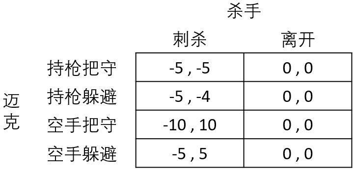

### 实验项目
实验6：不完全信息博弈的建模
### 实验目的
通过将刺杀博弈设计为游戏，熟悉完全但不完美信息博弈的均衡求解过程
### 游戏过程
1. 以《教父》中迈克医院救父情节为背景，计算机扮演迈克，人类玩家扮演杀手。
2. 计算机随机设定“自然”判定迈克是否持枪的概率分布，如持枪可能性和空手可能性各占50%等。此信息对人类玩家不公开。
3. 人类玩家设定双方各种策略组合下的得益情况（任意设定），可参考下表的例子：

4. 人类玩家输入杀手对迈克是否持枪的信念，如：
P(持枪|把守)=2/3，P(空手|把守)=1/3
P(持枪|躲避)=0，P(空手|躲避)=1
5. 游戏内部按照“自然”所给出的概率分布来自动确定迈克是否持枪（对人类玩家不公开）。
6. 第1阶段，计算机按照人类玩家给出的对杀手的信念，用逆向归纳法计算双方的均衡策略，显示迈克的行动并转化为条件概率，如：
若“自然”确定了迈克持枪，而比较期望得益获知迈克持枪时始终选择把守，则给出“把守”行动，条件概率为：P(把守|持枪)=1，P(躲避|持枪)=0
若“自然”确定了迈克空手，而比较期望得益获知迈克以混合策略选择行动，则按该混合策略随机给出“把守”或“躲避”，条件概率可能为： P(把守|空手)=1/2，P(躲避|空手)=1/2
7. 第2阶段，则给出“刺杀”和“离开”两个选项，由人类玩家自由选择。
8. 计算实际得益，显示双方的胜负。
9. 游戏内部使用贝叶斯法则验证人类玩家输入的信念是否与后验概率相符（显示比较结果）,
若不相符，则说明杀手判断失误，即便获胜也是纯属侥幸，可从第4步重新开始一轮新猜测；
若相符，则可列出双方的完美贝叶斯均衡。
10. 进阶设计：调换计算机和人类玩家的角色，由计算机扮演杀手，人类玩家扮演迈克。

## 实验要求
编程实现上述游戏过程。
撰写设计说明书（包括程序的设计细节和操作说明等），写入实验报告。
将游戏运行界面截图，粘贴到实验报告中。
实验源码（必须包含详细可阅读的注释）打包提交，命名为：“实验源码-实验6-学号-姓名.zip”。
实验报告电子版另存为PDF格式提交，命名为：“实验报告-实验6-学号-姓名.pdf”。
注意：实验源码和实验报告必须按指定格式命名，并提交指定文件格式的电子资料。