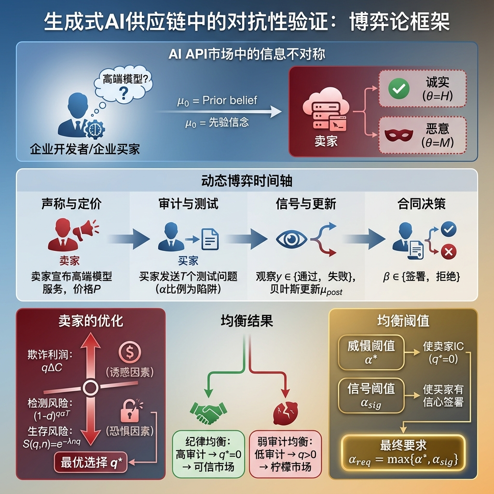
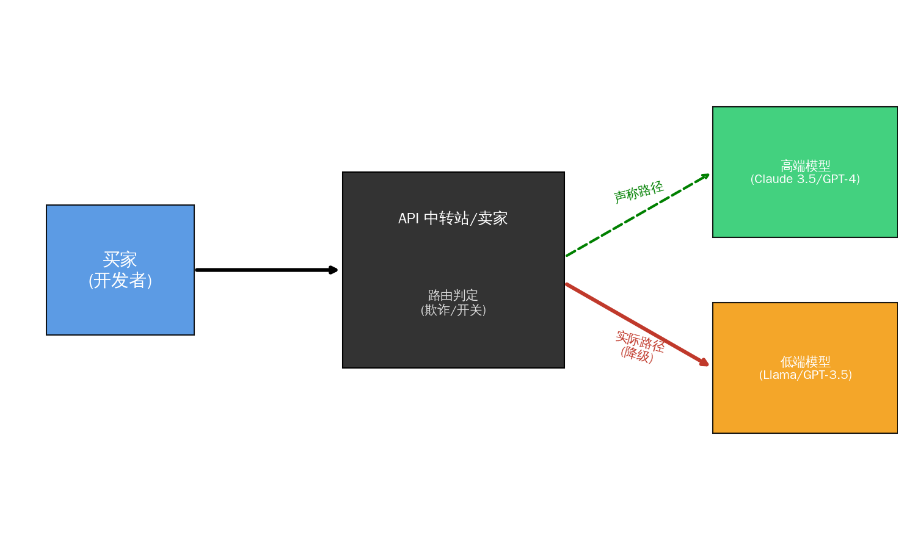
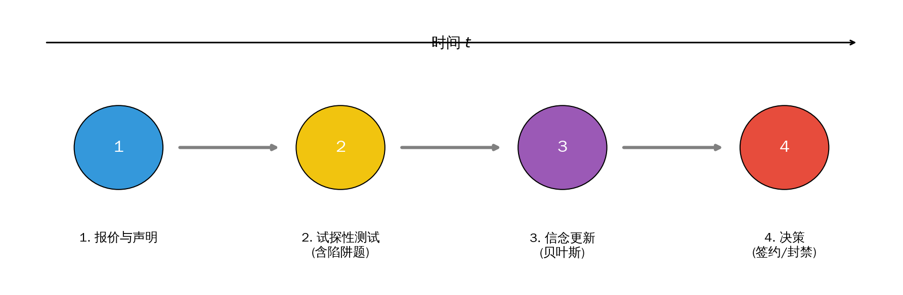
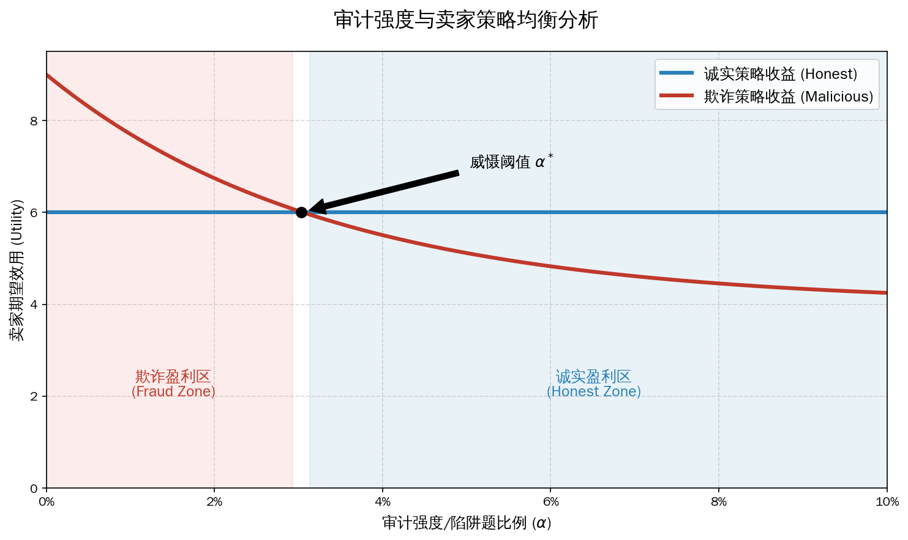

# 📝 信任黑盒——生成式 AI 供应链中的对抗性验证博弈模型  
**Trust in the Black Box: A Signaling Game of Adversarial Verification in Generative AI Supply Chains**

---

{width="95%"}

---

## 0. 背景补充：AI 编程趋势与 Claude Code

过去两年，AI 编程从“对话式助手”快速迈向“代理式工作流”：模型不仅回答问题，还能直接理解代码库、改多文件、跑测试并形成提交，逐渐嵌入终端与 IDE 的日常开发链路。Claude Code 正是这种趋势的代表，它把 Claude 模型放进终端，支持代码库级理解、命令执行、文件编辑与 VS Code / JetBrains 集成，目标是把“问题 → 修复 → 测试 → 提交”连成一条流。

为了衡量这些模型的“真修 Bug”能力，社区采用 SWE-bench 系列基准。以 Live-SWE-agent 的 SWE-bench Verified 公开榜为例，近期 SOTA 阵列包含 Claude Opus 4.5、Gemini 3 Pro、GPT‑5.2、Claude Sonnet 4.5、Kimi K2 等；而在更广的 SWE-bench 总榜/第三方榜单中，也能看到 DeepSeek 等开源模型进入前列。这种竞争强化了“高模更贵但更强”的市场分层。

价格与可得性进一步放大信息不对称：Claude Pro 月费约 \$20，Claude Code 随 Pro / Max 订阅提供，但官方明确存在使用量限制与地区/手机号限制。对重度编码用户或受限地区用户而言，常被感知为“贵且不够用”。由此催生了大量灰色“中转站”：一些卖家宣称通过共享/拆分高价订阅额度（如 \$200 的 Max 20x），或借助更便宜的云平台中转降低成本；也有人直接出售假 API 牟利。正是在“强模型需求上升 + 订阅受限 + 信息不对称”的背景下，本文的“降级/冒充模型”博弈尤为现实。

## 1. 博弈场景描述（Scenario Description）

{width="80%"}

在当前 LLM API 交易市场中存在严重信息不对称：买家（开发者/企业）希望购买高规格模型 API（例如 Claude Sonnet 4.5 或 GPT‑5.2 等高端模型），而卖家（中转站/聚合商）可能实施“模型降级攻击”（Model Downgrade Attack），对外声称提供昂贵模型，实则后端转发给廉价模型（如轻量级模型或旧代模型），赚取价差。

这是一个多阶段动态博弈：

1. **询价与声明**：卖家报价并声明“提供真高模”。
2. **试探性测试（Probing）**：买家在签约前发送一组测试题（普通题 + 陷阱题），并选择审计强度（陷阱题比例）。
3. **信念更新与签约**：买家观察通过/失败结果，用贝叶斯法更新对卖家诚信的信念，并决定是否签订长期合约（LTV）。
4. **长期后果**：若卖家持续欺诈，随着交易量累积，其账号被上游官方风控系统封禁的概率上升（生存概率下降）。

核心悖论：

- **买家验证悖论**：不验证容易被骗；验证越强成本越高且可能被对抗适配。
- **卖家生存悖论**：欺诈利润高，但同时面临失去大客户与被上游封号的双重风险。

---

## 2. 博弈模型设计（Model Formulation）

### 2.0 建模抽象与假设（Modeling Abstraction）

为了将上述供应链问题转化为数学模型，我们做如下抽象：

1.  **参与者抽象**：将供应链简化为两方——**买家**（下游开发者）与**卖家**（API 中转商）。
2.  **信息结构**：卖家私有信息为“真实类型”（是否拥有高模渠道），买家只能通过“测试信号”进行统计推断。
3.  **对抗机制**：将“测试”建模为信号发射过程，将“降级”建模为噪音干扰。买家通过调整陷阱题比例（审计强度 $\alpha$）来提高信号信噪比。
4.  **创新性风险表达**：不同于传统信号博弈中外生的“惩罚”，本模型引入**生存概率函数** $S(q,n)$。欺诈行为会通过上游风控系统产生累积效应，导致账号被封禁（生存概率归零），这构成了卖家的主要约束。

### 2.1 符号定义（Notation）

| 符号 | 含义 | 备注/范围 |
|---|---|---|
| $\theta$ | 卖家类型 | $\theta \in \{H(\text{诚实}), M(\text{恶意})\}$ |
| $\mu_0$ | 初始信任（先验） | $\mu_0=\Pr(\theta=H)$ |
| $q$ | 恶意卖家欺诈强度（降级比例） | $q\in[0,1]$ |
| $\alpha$ | 买家审计强度（陷阱题占比） | $\alpha\in[0,1]$ |
| $T$ | 测试题总数 | 整数 |
| $d$ | 单个陷阱题检出率 | $d\in(0,1)$ |
| $\beta$ | 签约决策 | $\beta\in\{0,1\}$ |
| $R$ | API 单次售价 | 常量 |
| $C_H, C_L$ | 真模型成本 / 假模型成本 | $C_H>C_L$ |
| $\Delta C$ | 套利空间 | $\Delta C=C_H-C_L$ |
| $LTV$ | 长期客户价值（未来净收益现值） | 常量 |
| $n$ | 未来交易规模 | 衡量合作规模 |
| $\lambda$ | 风控敏感系数 | 封号风险参数 |
| $\varepsilon$ | 诚实卖家技术失误率 | $\varepsilon\approx 0$ |
| $\delta$ | 折现因子 | $\delta\in(0,1]$ |
| $V_H, V_L$ | 买家高模/低模单位价值 | $V_H>V_L$ |
| $K(\alpha)$ | 买家审计成本 | 凸函数，如 $\frac{\kappa}{2}\alpha^2$ |

工程含义提示：$d$ 对应陷阱题（提示词工程/对抗测评）的“单题检出能力”，$T$ 对应测试题量（token 成本与时间成本），$K(\alpha)$ 对应审计成本（算力/人力/时间）。

---

### 2.2 博弈时序与策略（Game Form / Strategies）

{width="90%"}

这是一个带类型的不完全信息动态博弈：

1. 自然以概率 $\mu_0$ 选择卖家类型 $\theta\in\{H,M\}$。  
2. 卖家声明“提供真高模”并报价（声明视为 cheap talk，关键约束来自后续测试与风控）。  
3. 买家选择审计强度 $\alpha$ 并发送 $T$ 道测试题（其中 $\alpha T$ 为陷阱题）。  
4. 卖家选择欺诈强度 $q$：诚实型固定 $q=0$，恶意型可选 $q\in[0,1]$。  
5. 买家观察测试结果 $y\in\{\text{pass},\text{fail}\}$，更新信念 $\mu_{post}$，并选择签约 $\beta(y)$。  
6. 若签约，未来交易规模为 $n$，卖家面临上游风控，生存概率取决于 $(q,n)$。

---

### 2.3 信号生成机制与贝叶斯更新（Signal / Beliefs）

#### (1) 信号生成：把 $\alpha$ 微观化为 $T$ 与 $d$

恶意卖家以比例 $q$ 使用低模。测试集中陷阱题数量为 $\alpha T$。低模落在陷阱题上的期望次数约为 $q\alpha T$。每次触发陷阱题以概率 $d$ 暴露（被抓包）。若近似独立，则恶意卖家通过测试的概率为：

$$
\Pr(\text{pass}\mid \theta=M,q,\alpha)=(1-d)^{q\alpha T}
$$

诚实卖家（高模）也可能存在技术噪声 $\varepsilon$，则：

$$
\Pr(\text{pass}\mid \theta=H)=(1-\varepsilon)^T
$$

**一阶近似（Justify the approximation）**：当 $d$ 很小或 $q\alpha T$ 较小，可对 $(1-d)^{q\alpha T}$ 做对数/泰勒近似：

$$
(1-d)^{q\alpha T}
=\exp\big(q\alpha T\ln(1-d)\big)
\approx \exp(-dq\alpha T)
\approx 1-dq\alpha T
$$

> *注：假设 $d$ 较小或 $q\alpha T$ 较小，应用 $\ln(1-d)\approx -d$ 和 $e^{-x}\approx 1-x$。这简化了导数分析以推导解析阈值（如 $\alpha^*$）。对于数值案例研究（第4节），我们使用精确的对数形式以保证精度。*

#### (2) 贝叶斯更新

观察到 $y=\text{pass}$ 后，买家后验信念：

$$
\mu_{post}(q)=\Pr(H\mid \text{pass})
=\frac{\mu_0\Pr(\text{pass}\mid H)}{\mu_0\Pr(\text{pass}\mid H)+(1-\mu_0)\Pr(\text{pass}\mid M,q,\alpha)}
$$

代入信号生成：

$$
\mu_{post}(q)=
\frac{\mu_0(1-\varepsilon)^T}{\mu_0(1-\varepsilon)^T+(1-\mu_0)(1-d)^{q\alpha T}}
$$

当 $y=\text{fail}$ 时，买家可采用保守离轨信念 $\mu_{post}=0$（失败几乎等同于暴露），从而 $\beta(\text{fail})=0$，支持序贯理性。

---

### 2.4 收益函数（Payoffs）

#### 卖家收益

**(1) 当期利润：**

恶意卖家以概率 $(1-q)$ 用真高模、以概率 $q$ 用低模：

$$
\pi(q)=R-\big[(1-q)C_H+qC_L\big]=(R-C_H)+q\Delta C
$$

**(2) 上游风控生存概率（内生监管约束）：**

$$
S(q,n)=\exp(-\lambda nq)
$$

**(3) 恶意卖家期望效用：**

$$
\begin{aligned}
EU_M(q,\alpha)
&=(R-C_H)+q\Delta C
+\Pr(\text{pass}\mid q,\alpha)\cdot S(q,n)\cdot \Pr(\beta=1\mid \text{pass})\cdot \delta LTV \\
&=(R-C_H)+q\Delta C
+(1-d)^{q\alpha T}\cdot e^{-\lambda nq}\cdot \Pr(\beta=1\mid \text{pass})\cdot \delta LTV
\end{aligned}
$$

诚实卖家为 $q=0$ 的特例：

$$
EU_H=(R-C_H)+(1-\varepsilon)^T\cdot \Pr(\beta=1\mid \text{pass})\cdot \delta LTV
$$

#### 买家收益与签约阈值内生化

签约后的期望净收益（现值）：

$$
U_B(\text{sign}\mid \mu)
=\delta n\big[\mu(V_H-R)+(1-\mu)(V_L-R)\big]-K(\alpha)
$$

不签约收益设为 0。买家在观察到 pass 并更新为 $\mu_{post}$ 后，签约规则为：

$$
\beta(\text{pass})=\mathbf{1}\big[U_B(\text{sign}\mid \mu_{post})\ge 0\big],\quad
\beta(\text{fail})=0
$$

从 $U_B\ge 0$ 得到签约信任阈值：

$$
\mu_{post}\ge \mu_{th}=\frac{R-V_L}{V_H-V_L}
$$

为保证 $\mu_{th}\in[0,1]$，通常需满足 $V_H>R>V_L$；若不满足，可将阈值截断到 $[0,1]$ 以保持策略定义一致。

---

## 3. 均衡分析（Equilibrium Analysis）

{width="80%"}

我们寻求一个精炼贝叶斯均衡（PBE）。重点不在“抓坏人”，而在“威慑坏人不敢作恶”（Deterrence / Discipline）。

### 3.1 两类均衡直觉

- **低审计/弱治理（Pooling on fraud）**：若 $\alpha$ 很低或审计成本过高，测试无法有效区分类型，恶意卖家倾向选较高 $q$ 赚取 $\Delta C$。  
- **纪律均衡（Discipline / Incentive-Compatible）**：买家施加足够的审计与（或）平台风控足够强，使恶意卖家提高 $q$ 的边际收益小于边际风险成本，从而最优 $q^*=0$。

### 3.2 分离/纪律条件（可操作阈值）

为得到可操作阈值，我们在“轻度欺诈/试用期”情形下对未来项做一阶近似，并取 $\Pr(\beta=1\mid pass)\approx 1$。注意：

$$
(1-d)^{q\alpha T}e^{-\lambda nq}
=\exp\big(q\alpha T\ln(1-d)-\lambda nq\big)
\approx \exp\big(-(d\alpha T+\lambda n)q\big)
\approx 1-(d\alpha T+\lambda n)q
$$

因此，恶意卖家期望效用在 $q$ 的边际斜率近似为：

$$
\frac{\partial EU_M}{\partial q}\approx \Delta C-\delta LTV(d\alpha T+\lambda n)
$$

若满足：

$$
\delta LTV\,(d\alpha T+\lambda n)\ge \Delta C
$$

则 $\frac{\partial EU_M}{\partial q}\le 0$，恶意卖家最优选择 $q^*=0$，形成纪律均衡。

解得审计强度阈值：

$$
\alpha\ge \alpha^*=\frac{\Delta C/(\delta LTV)-\lambda n}{dT}
$$

定义**欺诈诱惑指数（Fraud Temptation Index）**：

$$
\Omega=\frac{\Delta C}{\delta LTV}-\lambda n
$$

则：

$$
\alpha^*=\frac{\Omega}{dT}
$$

解释：
- $\Delta C/(\delta LTV)$：贪婪因子（价差越大、未来价值越小，诱惑越强）  
- $\lambda n$：恐惧因子（量越大、风控越严，诱惑越弱）  
- $dT$：检出能力（陷阱题更锋利或题量更足，所需 $\alpha$ 越低）

### 3.3 审计成本的闭环

在纪律均衡中，买家往往选择满足威慑的**最小审计**：

$$
\alpha_B^*=\alpha^*
\quad \text{provided}\quad
K(\alpha^*)\le \text{Expected Loss from Fraud}
$$

若 $K(\alpha^*)$ 过高，买家可能降低 $\alpha$ 并退出市场或转向更可信渠道，市场退化为弱治理区。

### 3.4 形式化的精炼贝叶斯均衡（PBE）表述

为满足“策略—信念—序贯最优”三要素，我们给出一个可检验的 PBE 写法。

**策略集：**

- 买家策略：先选审计强度 $\alpha\in[0,1]$；观测 $y\in\{\text{pass},\text{fail}\}$ 后选 $\beta(y)\in\{0,1\}$。  
- 卖家策略：诚实型 $q_H(\alpha)\equiv 0$；恶意型选择 $q_M(\alpha)\in[0,1]$ 最大化 $EU_M(q,\alpha)$。

**信念：**

对路径上信号 $y=\text{pass}$，信念按贝叶斯一致性更新：

$$
\mu(\text{pass})=
\frac{\mu_0\Pr(\text{pass}\mid H)}{\mu_0\Pr(\text{pass}\mid H)+(1-\mu_0)\Pr(\text{pass}\mid M,q_M(\alpha),\alpha)}
$$

对 $y=\text{fail}$，可取保守离轨信念 $\mu(\text{fail})=0$（失败强指向降级/异常链路），从而 $\beta(\text{fail})=0$ 支持序贯理性。

**序贯最优（最关键的“闭环”）：**

1) 恶意卖家的最优响应满足：

$$
q_M(\alpha)\in \arg\max_{q\in[0,1]} EU_M(q,\alpha)
$$

并由上节推得一个可操作的纪律条件：当 $\alpha\ge \alpha^*$ 时，$q_M(\alpha)=0$（至少在一阶近似下成立）。

2) 买家的签约决策在观测 $y$ 后满足：

$$
\beta(y)\in \arg\max_{\beta\in\{0,1\}} \beta\cdot \delta n\Big(\mu(y)(V_H-R)+(1-\mu(y))(V_L-R)\Big)
$$

等价地，买家在 $y=\text{pass}$ 时签约当且仅当 $\mu(\text{pass})\ge \mu_{th}=\frac{R-V_L}{V_H-V_L}$；在 $y=\text{fail}$ 时不签约。

**两个典型 PBE（便于阅卷与对照）：**

- **纪律均衡（Discipline PBE）**：买家选 $\alpha\ge \alpha^*$；恶意卖家最优 $q_M(\alpha)=0$；买家在 pass 后签约、fail 后拒绝。该均衡体现“威慑使作恶不再最优”。  
- **弱审计均衡（Weak-Audit / Pooling）**：买家选较小 $\alpha$（甚至 $\alpha=0$），恶意卖家选择更高的 $q$（趋向套利）；pass 信号信息量低，买家后验接近先验，市场更容易出现“劣币驱逐良币”。

### 3.5 买家最优审计：从“威慑阈值”到“签约阈值”

上节的 $\alpha^*$ 解决了“让坏人不敢坏”（卖家激励相容），但在真实采购中，买家还常常需要“让自己敢买”（pass 之后后验信任足够高）。因此实践里可把审计强度分成两个阈值：

#### (1) 威慑阈值（卖家 IC）

$$
\alpha^*=\max\left\{0,\ \frac{\Delta C/(\delta LTV)-\lambda n}{dT}\right\}
$$

#### (2) 筛选阈值（Bayes-可签约）

取一个保守假设：若卖家是恶意型，就在测试阶段做“满额降级” $q=1$。则

$$
\Pr(\text{pass}\mid M,q=1,\alpha)=(1-d)^{\alpha T}
$$

在 $\varepsilon\approx 0$ 时，$\Pr(\text{pass}\mid H)\approx 1$，于是

$$
\mu(\text{pass})
=\frac{\mu_0}{\mu_0+(1-\mu_0)(1-d)^{\alpha T}}
$$

要让买家在 pass 后签约，需要 $\mu(\text{pass})\ge \mu_{th}$，可解得筛选阈值：

$$
\alpha_{\text{sig}}
=
\frac{\ln\!\left(\frac{\mu_{th}(1-\mu_0)}{\mu_0(1-\mu_{th})}\right)}{T\ln(1-d)}
\quad(\text{当右侧为正时})
$$

> 直觉：$\mu_0$ 越低（先验越不信）、$\mu_{th}$ 越高（低模越不可接受）、$dT$ 越小（陷阱不锋利/题量不足），就需要更大的 $\alpha$ 才能让一次 pass “足够有说服力”。

#### (3) 买家最优审计（可执行的决策规则）

若审计成本 $K(\alpha)$ 单调凸（如 $K(\alpha)=\frac{\kappa}{2}\alpha^2$），在“想进入可信交易”的情况下，买家会选满足两类阈值的最小审计：

$$
\alpha_{\text{req}}=\max\{\alpha^*,\alpha_{\text{sig}}\},\qquad
\alpha_B^*=
\begin{cases}
\alpha_{\text{req}}, & \delta n(V_H-R)\ \text{足以覆盖}\ K(\alpha_{\text{req}}) \\
0, & \text{否则退出/转官方渠道}
\end{cases}
$$

这给出了一个直接可用的采购计算流程：先算 $\alpha^*$（能不能威慑），再算 $\alpha_{\text{sig}}$（能不能放心签），最后用 $K(\alpha)$ 判断“值不值得审”。

---

## 4. 数值案例演示（Numerical Illustration）

场景：某中型企业考虑从“中转站 A”采购高端模型 API。企业担心对方“宣称高模、实际降级”，决定先做一次试用测评再决定是否签长期单。

**参数设定（可复现）：**

- 卖家成本：$C_H=10,\ C_L=1\Rightarrow \Delta C=9$  
- 买家价格/价值：$R=20,\ V_H=25,\ V_L=12$（高模净收益 $V_H-R=5$，低模净收益 $V_L-R=-8$）  
- 先验信任：$\mu_0=0.5$，诚实方技术噪声忽略（$\varepsilon\approx 0$）  
- 卖家长期价值与风控：$LTV=40,\ \delta=1,\ \lambda=0.001,\ n=100$  
- 测试方案：总题数 $T=40$，单个陷阱题检出率 $d=0.3$  
- 审计成本：$K(\alpha)=\frac{\kappa}{2}\alpha^2,\ \kappa=5000$

### 步骤 1：算“买家敢签”的阈值 $\mu_{th}$

$$
\mu_{th}=\frac{R-V_L}{V_H-V_L}
=\frac{20-12}{25-12}
=\frac{8}{13}\approx 0.615
$$

解释：买家只有在“pass 之后足够相信对方给的是高模”（后验信任 $\ge 61.5\%$）时才会签约，否则宁可不买。

### 步骤 2：算“卖家不敢骗”的阈值 $\alpha^*$

$$
\alpha^*=
\frac{\Delta C/(\delta LTV)-\lambda n}{dT}
=\frac{9/40-0.001\times 100}{0.3\times 40}
=\frac{0.225-0.1}{12}
\approx 0.0104
$$

含义：当陷阱题占比超过约 $1.04\%$ 时（或等价的有效检出强度足够大），恶意卖家在一阶近似下会被“长期损失 + 风控风险”压住，最优选择 $q\approx 0$（不降级）。

### 步骤 3：算“pass 足够有说服力”的筛选阈值 $\alpha_{\text{sig}}$

保守假设：恶意卖家若想套利，就在测试期做满额降级 $q=1$。则其通过测试概率为：

$$
p_M(\alpha)=(1-d)^{\alpha T}=0.7^{40\alpha}
$$

在 $\varepsilon\approx 0$ 下，$p_H\approx 1$，于是

$$
\mu(\text{pass})=\frac{\mu_0}{\mu_0+(1-\mu_0)p_M(\alpha)}
$$

要求 $\mu(\text{pass})\ge \mu_{th}$，代入 $\mu_0=0.5,\ \mu_{th}=8/13$ 可得：

$$
p_M(\alpha)\le \frac{\mu_0(1-\mu_{th})}{\mu_{th}(1-\mu_0)}
=\frac{0.5(1-8/13)}{(8/13)\cdot 0.5}
=0.626
$$

因此需满足：

$$
0.7^{40\alpha}\le 0.626
\Rightarrow 40\alpha\ge \frac{\ln(0.626)}{\ln(0.7)}\approx 1.31
\Rightarrow \alpha_{\text{sig}}\approx 0.0328
$$

也就是说，想让“一次 pass”把后验信任拉到足够签约的水平，需要陷阱题占比约 $3.28\%$ 以上。

### 步骤 4：给出最终选择与结果（闭环）

买家最小需求审计强度：

$$
\alpha_{\text{req}}=\max\{\alpha^*,\alpha_{\text{sig}}\}\approx 3.28\%
$$

取一个实现上更方便的整数题量：令 $\alpha=5\%$，则陷阱题约 $\alpha T=2$ 道。

1) **若卖家恶意且降级（$q=1$）**：  
通过测试概率 $p_M=0.7^2=0.49$；观察到 pass 后，

$$
\mu(\text{pass})=\frac{0.5}{0.5+0.5\times 0.49}\approx 0.671>\mu_{th}
$$

买家会签约。签约后每次调用的期望净收益：

$$
\bar{v}= \mu(\text{pass})(V_H-R)+(1-\mu(\text{pass}))(V_L-R)
=0.671\times 5+0.329\times(-8)\approx 0.723
$$

试用通过后的合同期总收益（现值）约为 $\delta n\bar{v}=100\times 0.723=72.3$。考虑审计成本：

$$
K(0.05)=\frac{5000}{2}\times 0.05^2=6.25
$$

因此“做审计并在 pass 后签约”是正收益的决策。

2) **而在均衡路径上（$\alpha\ge \alpha^*$）**：  
恶意卖家预期未来损失更大，会被威慑到选择 $q\approx 0$，从源头上减少降级动机；买家用 $\alpha_{\text{req}}$ 同时实现“威慑 + 筛选”，得到稳定的高模供给。

---

## 5. 总结与应用前景（Conclusion & Implications）

### 模型特点

1. **监管压力内生化（New Model 核心特征）**：传统博弈常假设欺诈被发现后仅支付固定罚款。本模型构建了 $S(q,n)=e^{-\lambda nq}$ 生存函数，刻画了“黑号风险”随交易规模与欺诈强度呈**指数级累积**的过程，这是针对 AI 供应链风控机制的**全新建模创新**。
2. **对抗性验证微观基础**：将抽象的审计变量 $\alpha$ 拆解为 $T$（题量）与 $d$（对抗性检出率）。这使得模型能直接指导工程实践：不仅可以通过增加题量 $T$ 威慑，还可以通过对抗性提示词工程提高 $d$ 来降低审计成本，建立了“博弈论-Prompt工程”的理论桥梁。
3. **双阈值治理机制**：区分了“威慑阈值 $\alpha^*$”（让卖家不敢骗）与“筛选阈值 $\alpha_{\text{sig}}$”（让买家敢买），论证了仅有威慑是不够的，必须同时满足贝叶斯后验可信度，填补了单边视角的理论空白。
4. **威慑视角**：从传统的“识别坏人”转向机制设计层面的“让坏人不敢坏”，实现了从被动防御到主动治理的范式转换。

### 应用前景

- **企业采购策略**：  
  - 大额长周期订单（$LTV$ 大、$n$ 大）往往天然处于纪律区，可降低审计频率，甚至采用“抽检式免检”。  
  - 小额短单必须提高 $\alpha$ 或提升 $d$（更强陷阱题）以避免被降级。  

- **平台治理**：  
  - 平台可通过提高 $\lambda$（风控敏感度）或引入赏金式抽查机制，使市场更容易进入纪律均衡，减少劣币驱逐良币。

### 参数可校准性（如何把模型落到工程数据）

- $\Delta C$：由不同档位模型的单位成本/报价差估计（或用“同 token 量的真实计费差”近似）。  
- $\mu_0$：由商家历史口碑、可验证的公开信息、过往交易记录形成先验。  
- $d$：用“陷阱题/金丝雀提示词”离线评测得到——在已知低模/中模上跑同一套测试，统计被检出的频率。  
- $\varepsilon$：在可信渠道（直连/官方）跑同套测试，统计超时、异常回复等“非恶意失败率”。  
- $\lambda$：用历史封禁/限流事件做粗略风险回归（交易量与异常行为越多，风险越高），在企业内部可视为可调的风险厌恶参数。  
- $LTV,n,\delta$：来自业务侧（订单周期、调用量预测、折现/资金成本）。

### 局限与可扩展方向（进一步“新模型化”）

1. **独立性假设偏强**：陷阱题之间可能相关（同类提示词被同样绕过），会高估检出效果。可用“多族群陷阱题 + 多样化分布”缓解。  
2. **对抗适配（$d$ 不是常数）**：中转站会学习你的测试集，导致 $d$ 随轮次下降。可将其扩展为动态博弈：$d_t=d_0e^{-\rho t}$，买家通过“随机抽检 + 轮换金丝雀”维持有效检出。此时威慑阈值随时间变为 $\alpha_t^*=\frac{\Delta C/(\delta LTV)-\lambda n}{d_tT}$，解释了“早期重审计、后期随机抽检”的行业实践。  
3. **多方机制设计**：引入平台/第三方担保作为博弈参与者（提高 $\lambda$ 或设置押金/赔付），可把威慑从“买家自证”转为“制度性约束”，降低单个买家的审计成本。  
4. **观测噪声与误报**：有些失败来自网络/限流/上下游变更而非降级，需要把 $y$ 扩展为多值信号（延迟、token、对齐风格、拒答模式），用似然比做更稳健的后验更新。
